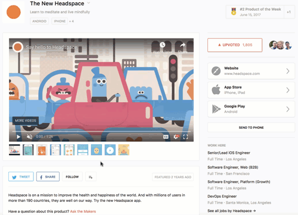

## A comprehensive user notification service

We're building AllFrequencies into a comprehensive multi-channel user notification service. We make it easy to add
simple or sophisticated notification options to your product.

### The problem
A wide variety of products provide (or should provide) notification options to their users, for everything from
<a href="https://help.calendly.com/hc/en-us/articles/360001224834-Invitee-Notifications" target="_blank">upcoming meeting reminders</a>
(Calendly) to
<a href="https://circleci.com/docs/2.0/notifications/#enable-chat-notifications" target="_blank">notifications</a>
when your build breaks (CircleCI) to
<a href="https://www.flexport.com/help/13-flexport-app-notification-settings" target="_blank">alerts</a>
for issues with your international freight shipment (Flexport).

However, most in-product notification systems are built in-house, lack clear internal owners, and rarely improve
after they're initially released (if they ever ship at all). Tasks like adding new types of notifications or allowing
users to get notifications over new channels like SMS or Slack become inordinately expensive and are put off again
and again.

### The solution
With AllFrequencies, our goal is to allow you to implement basic notifications for your users in minutes, and provide
a platform that allows you to evolve your notification options without limit.

### How we're building it

We're building AllFrequencies incrementally, to address a greater and greater variety of use cases.

### Phase 1: Drop-in subscribe button



First off, we're making it easy to let your users subscribe to notifications for particular resources in your product.
A "resource" could be anything in your product, for instance:

* A product in Product Hunt
* A shipment in Flexport
* An experiment in Optimizely

Providing subscription options is as simple as:

1. [Serving a secure user token to your frontend](#serving-a-secure-user-token)
2. [Adding our pre-built button to the resource's UI](#adding-the-button)
3. [Making a single API call when an event that should trigger a notification occurs](#calling-the-api)

Of course, the underlying APIs are public and the components are open-source, so you can customize freely.

### Serving a secure user token

A secure user token ensures your users can only change their own subscription preferences.

The token is simply a JWT (JSON Web Token) signed with the signing secret AllFrequencies provides. You create it
server-side and serve it to your frontend however you like. For instance, you could
use [PyJWT](https://github.com/jpadilla/pyjwt) (`pip install PyJWT`) to generate a user token like so:

```python
import datetime
import os

import jwt

SIGNING_SECRET = 'your_secret'

user_id = 'user123'

payload = {'exp': datetime.datetime.utcnow() + datetime.timedelta(days=1),
           'user_id': user_id}

af_token = jwt.encode({'user_id': user_id}, SIGNING_SECRET, algorithm='HS256')
```

### Adding the button

If you're using React, you simply install the AllFrequencies npm package and add the ready-made subscribe button:


```javascript
<AFSubscribeButton
    appId="your_allfrequencies_app_id"
    resourceType="product_post"
    resourceId="product789"
    userToken="user_token"
    userEmail="sam@example.com"  // optional; allows AllFrequencies to automatically configure email alerts
    buttonText="Follow"  // optional
    eventTypes={{comments: {displayName: "comments",
                            defaultChannels: ["email"],
                            allowedChannels: ["email", "sms", "slack", "webhook"]},
                 upvoteMilestones: {displayName: "upvote milestones",
                                    defaultChannels: ["email"],
                                    allowedChannels: ["email", "slack", "webhook"]}}} />
```


If you're not using React, we'll build a component for your stack. Just reach out to help@allfrequencies.io.

### Calling the API

To deliver notifications to users who have subscribed to a resource, you simply make a single POST request to
`https://api.allfrequencies.com/v1/notifications` with the API token AllFrequencies provides and a JSON payload
like this:


```json
{
  "uuid": "4ce72a5f-026c-4998-afeb-3d09524ca8df",
  "resource_type": "product_post",
  "resource_id": "product789",
  "event_type": "comments",
  "email": {
    "subject": "New comment on the product \"Headspace 2.0\"",
    "body": "Ryan Hoover (@rrhoover) added the comment: \"@kevinrose and @mulligan were raving about Headspace the other day.\""
  },
  "sms": {
    "sender_id": "PRODUCTHUNT",
    "message": "Ryan Hoover added a new comment to the product \"Headspace 2.0\" in PH. Check it out at https://www.producthunt.com/posts/headspace-2-0."
  },
  "slack": {
    "title": "New comment from Ryan Hoover on product \"Headspace 2.0\"",
    "title_link": "https://www.producthunt.com/posts/headspace-2-0",
    "text": "@kevinrose and @mulligan were raving about Headspace the other day."
  },
  "webhook": {
      "event": "products.comment",
      "product": {
        "id": "product789",
        "name": "Headspace 2.0",
        "url": "https://www.producthunt.com/posts/headspace-2-0"
      },
      "user": {
        "username": "rrhoover",
        "name": "Ryan Hoover"
      },
      "body": "@kevinrose and @mulligan were raving about Headspace the other day."
  }
}
```
